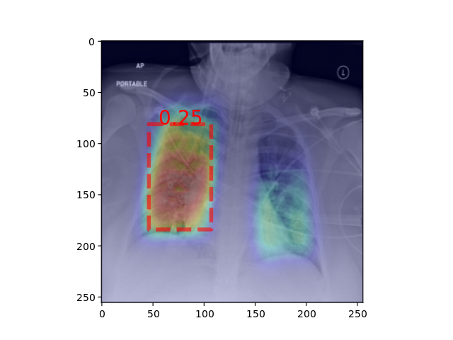

<!--- Licensed to the trainML under one -->
<!--- or more contributor license agreements.  See the NOTICE file -->
<!--- distributed with this work for additional information -->
<!--- regarding copyright ownership.  The trainML this file -->
<!--- to you under the Apache License, Version 2.0 (the -->
<!--- "License"); you may not use this file except in compliance -->
<!--- with the License.  You may obtain a copy of the License at -->

<!---   http://www.apache.org/licenses/LICENSE-2.0 -->

<!--- Unless required by applicable law or agreed to in writing, -->
<!--- software distributed under the License is distributed on an -->
<!--- "AS IS" BASIS, WITHOUT WARRANTIES OR CONDITIONS OF ANY -->
<!--- KIND, either express or implied.  See the License for the -->
<!--- specific language governing permissions and limitations -->
<!--- under the License. -->

<div align="center">
  <a href="https://www.trainml.ai/"></a><br>
</div>


trainML Tutorials - PyTorch Pneumonia Detection Pipeline
=====



## Overview

This tutorial is designed to demonstrate a typical machine learning development workflow using trainML GPUs.  It walks through how to create a [trainML Dataset](https://app.trainml.ai/datasets), build an initial model using a [trainML Notebook](https://app.trainml.ai/jobs/notebook), run parallel hyperparameter tuning experiments using [trainML Training Jobs](https://app.trainml.ai/jobs/training), save the results of a marathon training job to a reusable [trainML Model](https://app.trainml.ai/models), use that model to run a [trainML Inference Job](https://app.trainml.ai/jobs/inference) on a batch of new images, and receive the results on your local computer.  The data used by this tutorial consists of DICOM files of chest radiographs and their associated labels from the Kaggle [RSNA Pneumonia Detection Challenge](https://www.kaggle.com/c/rsna-pneumonia-detection-challenge).  The model code was largely adapted from [Kaggle notebooks](https://www.kaggle.com/giuliasavorgnan/0-123-lb-pytorch-unet-run-on-google-cloud) by Guilia Savorgnan.  The following changes were made to the original code to better facilitate the tutorial:

- Changed all directory path references to match the location of the data, temp, and output directories in the trainML job environment.
- Converted the notebooks into python scripts with an [argparse](https://docs.python.org/3/howto/argparse.html) command line interface.
- Exposed and implemented additional hyperparameter settings.
- Added rudimentary tensorboard logging.
- Changed prediction logic to save the predictions as JSON and save annotated images as PNGs.

> This code is for illustrative purposes only.  It is not meant as an example of a high performing or efficient model.  It's only purpose is to show the various ways the trainML capabilities can be utilized in the model development process.  Do NOT use this in production.

Running the full tutorial as documented should cost approximately 10 credits ($10) if your account is still under the 50 GB free storage allotment.

### Prerequisites

Before beginning this tutorial, ensure that you have satisfied the following prerequisites.

- A valid [trainML account](https://auth.trainml.ai/login?response_type=code&client_id=536hafr05s8qj3ihgf707on4aq&redirect_uri=https://app.trainml.ai/auth/callback) with a non-zero [credit balance](https://docs.trainml.ai/reference/billing-credits/)
- Local connection capability [prerequisites](https://docs.trainml.ai/reference/connection-capability/#prerequisites)
- Valid [Kaggle](https://www.kaggle.com) account with [Kaggle Keys](https://docs.trainml.ai/reference/third-party-keys/#kaggle-keys) configured in your trainML account.
- Accepted the competition terms of the [RSNA Pneumonia Detection Challenge](https://www.kaggle.com/c/rsna-pneumonia-detection-challenge) on Kaggle.

## Model Development

### Dataset Staging

The first step in building an initial model is to load the training data as a [trainML Dataset](https://docs.trainml.ai/reference/datasets).  The training data can be viewed [here](https://www.kaggle.com/c/rsna-pneumonia-detection-challenge/data).  In order to create a trainML dataset from Kaggle competition data, login to the trainML web interface and navigate to the [Datasets Dashboard](https://app.trainml.ai/datasets).  Click the `Create` button from the dashboard.  Enter a memorable name in the name field (e.g. `RSNA Pneumonia Detection`), select `Kaggle` as the source type, select `Competition` as the type, and enter `rsna-pneumonia-detection-challenge` as the path.  Click the `Create` button to begin the dataset creation.  Once the dataset changes to the `ready` status, it can be used in the subsequent steps.

> If the `Kaggle` option is disabled, you have not yet configured your Kaggle API keys in your trainML account.  Follow the instructions [here](https://docs.trainml.ai/reference/third-party-keys/#kaggle-keys) to proceed.

The RSNA Pneumonia Detection dataset has two sets of images `stage_2_train_images` and `stage_2_test_images`.  Only the "train" images have labels.  We will use the "train" images during the training process and the "test" images to demonstrate the inference process.  For the inference process, you should also download the Kaggle data to your local computer using the command: 

`kaggle competitions download -c rsna-pneumonia-detection-challenge`

Once the download completes, unzip the file and save the contents of the `stage_2_test_images` folder to a memorable location (the tutorial uses `~/rsna-pneumonia-detection-challenge/new_images`).  The rest of the data can be deleted.

### Initial Model Creation

The easiest way to start a new project is with a [trainML Notebook](https://docs.trainml.ai/getting-started/running-notebook/).  Navigate to the [Notebooks Dashboard](https://app.trainml.ai/jobs/notebook) and click the `Create` button.  Input a memorable name as the job name and select an available GPU Type (the code in this tutorial assumes a `RTX 2080 Ti`).  Expand the `Data` section and click `Add Dataset`.  Select `My Dataset` as the dataset type and select the dataset you created in the previous section from the list (e.g. `RSNA Pneumonia Detection`).  Expand the `Model` section and specify the project's git repository url `https://github.com/trainML/pytorch-pneumonia-detection.git` to automatically download the tutorial's model code.  Click `Next` to view a summary of the new notebook and click `Create` to start the notebook.

Once the notebook reaches the `running` state, click the `Open` to access the notebook instance.  Inside the [Jupyter Lab](https://jupyter.org) environment, the file browser pane on the left will show two directories, `input` and `models`.  The `input` folder contains the RSNA Pneumonia dataset and the `models` folder contains the code from the git repository.  Double click on the models folder and open the `eda-adapted` notebook.  This notebook contains some exploratory data analysis on the dataset.  The original source is located [here](https://www.kaggle.com/giuliasavorgnan/start-here-beginner-intro-to-lung-opacity-s1), it was only modified to direct file path variables to the correct location with the trainML job environment.  It also generates a features file that is required for the model training notebook.  Either run this notebook to generate the file or run `python data_processing.py` from a terminal tab.

> The `train.csv` file generated from the notebook or script must be present in the models directory in order for the subsequent steps to succeed.

Once the `train.csv` appears in the file explorer in the `models` folder, open the `pytorch-pneumonia-detection` notebook.  This notebook contains the model training and evaluation code.  You can find the original [here](https://www.kaggle.com/giuliasavorgnan/0-123-lb-pytorch-unet-run-on-google-cloud).  You can either review the stored results or run all cells to observe the training yourself.  **To shorten the duration, change the `Debug` variable to True**

> Take note of how the [trainML environment variables](https://docs.trainml.ai/reference/environment-variables/) are used to define the different data paths in both the notebooks and as the default arguments in the data_processing.py script.  This is the recommended way to define file locations in code when using the trainML job environment.

Continue to explore the notebook design and job environment as desired.  In most real projects, the objective of the notebook stage is to ensure the data is being loaded correctly and the model code is executing correctly before moving on to longer duration training experiments.

## Model Training

### Adapting the Notebook for Training

Notebooks are great for exploratory data analysis and stepping through code once block at a time.  However, to run large scale experiments or productionalize a model, it should be converted into callable python scripts.  During this process, a key consideration is which variables should be exposes as "inputs" to the script during training and inference.  Typically, these variables fall into at least 3 categories; environment settings, features switches, and hyperparameters.  Environment settings allow the script to adapt to different execution environments (e.g. your laptop versus Kaggle versus trainML).  Common environment settings are the file path for the input data, how many GPUs are available, and where to save the model checkpoints or outputs.  Features switches control if certain logic is executed or not.  Common feature switches include enabling tensorboard logging, placing the script in debug mode, or running a particular data processing step.  Hyperparameters are whichever model parameters you wish to expose for training experiments.  Typical hyper parameters are learning rate, number of epochs, etc. but can also be setup to change the model's optimizer,  pre-trained backbone, number of layers, or anything else.

Once you have selected the interesting variables to set at runtime, you must also implement a method for reading those variables during execution.  There are numerous methods to accomplish this. Options includereading from a yaml or json file, setting environment variables, parsing command line arguments, or using another library.  This tutorial is designed using the python built-in [argparse library](https://docs.python.org/3/howto/argparse.html) to specify variable as command line parameters to the training and prediction scripts.

The `.py` files in this code repository show an example of how the notebook could be converted into python scripts.  The `dataset`, `model`, and `metrics` .py files contain many of the core functions related to those parts of the original notebook.  The `train` and `predict` scripts contain the rest of the logic and serve as the entry points for running the model.  The `data_processing` files is a converted version of the exploratory data analysis notebook that generates a csv file required for the rest of the scripts to work.

In addition to breaking out some functions and classes into their own files, the two main changes are the implementation of a main function and the argparse setup:

```
if __name__ == "__main__":
    parser = make_parser()
    args = parser.parse_args()
```

All the required parameters are then defined with their types, defaults, and allowed options in the `make_parser` function.  At runtime, the `args` object gets passed to the function the script calls and its values can be passed to subsequent methods.  This allows the user to run the script like this:

```
python train.py --debug --optimizer adamax
```

This will set `args.debug` to `True` and `args.optimizer` to `adamax`, which can then be referenced in the training loop code.

The scripts in the repository additionally implement basic tensorboard logging, saving annotated images as files, and allowing the user to specify the optimizer at runtime.  You should verify that your scripts successful execute and start training using the terminal window in a Notebook instance before moving on to the next step.

### Parallel Hyperparameter Search

Now that the model code is organized with a scriptable interface, running training experiments becomes very simple.  The example code exposes the type of optimizer as a hyperparameter, with 5 different options.  Rather than run each of them one at a time and having to wait 2+ hours for each, trainML [training jobs](https://docs.trainml.ai/getting-started/running-training/) allow you to run these experiments in parallel.  The easiest way to start a training job is by converting a working notebook into one.  From the [Notebooks Dashboard](https://app.trainml.ai/jobs/notebook), select the notebook job created in the previous section.  If it is either `running` or `stopped`, the `Copy` button is enabled at the top of the dashboard.  Click the button and the copy notebook form will appear.  Select `Convert to Training Job` as the copy type and give the job a memorable name.  Leave the current dataset selected and select `Local` as the output type.  Create an empty directory on your computer and specify the path as the `Output storage path` (e.g. `~/rsna-pneumonia-detection-challenge/output`).  This will instruct the job workers to send their training results to that directory in on your local computer.

> Using the `Local` storage type requires [prerequisites](https://docs.trainml.ai/reference/connection-capability/) to be satisfied.  Ensure your computer is properly configured before using this setting.

Since we have 5 optimizer types to try, set the `Number of Workers` to `5`.  Enter the following commands, one for each worker:

```
python train.py --optimizer adam
python train.py --optimizer adamw
python train.py --optimizer adamax
python train.py --optimizer sgd
python train.py --optimizer adagrad --lr 0.1
```
> If you choose to run this training job from the `Create` button on the Training Job Dashboard instead of the copying the notebook, you must prefix the above five commands with `python data_processing.py && ` in order to generate the `train.csv` file the training script requires.

Click the `Copy` button to start the training.  Note that this does not require you to stop working in the notebook to run the experiment, however, any changes to the notebook after the copy process is complete will not affect the new training job.

Once the training job enters the `running` state, you can monitor the training progress by clicking the `View` button.  Log message from the workers will stream to this view.  The job will run for approximately 5 hours on `RTX 2080 Ti` GPUs.  Before the job ends, you must click the `Connect` button and follow the instructions to allow the workers to upload their results to your computer.  

> When using the `Local` output type, workers will wait indefinitely for you to connect, and you will continue to billed until the upload completes.

Once connected, you will also see the worker logs streaming in your terminal window.  Once the all workers complete, you should see 5 new files in the directory you specified earlier.  If you extract these files you will find the saved model checkpoints, a folder containing the validation images with annotations, and a logs folder containing the tensorboard logs.  Additionally, to download an extract of the workers' output logs, go back to the Training Dashboard and click the name of the training job.  On the job details page, you will see a `Download Logs` button next to each `finished` worker.  Click this to download the logs.

Review the results of all the worker runs to decide which optimizer was most effective.  You can also run additional experiment changing other hyperparameters.  In the worker log output, the last line prior to the messages pertaining to the data upload shows the `Total Average Precision: ` at the end of the training run.  Your results may vary, but in the example run used to build this tutorial, the `adamw` optimizer had the highest precision of `0.043`.  As a result, we will select this option when doing the final training run in the next step.

### Marathon Training

Once the best hyperparameters have been selected, the next step is to run a longer training run to get the best model possible.  Training jobs are the best job type for this as well.  To start this process, navigate to the Training Job Dashboard and click the `Create` button.  Choose a memorable name for the job and select `RTX 2080 Ti` as the `GPU Type`.  Click `Add Datasets` in the `Input Data` section and select the same dataset as used in the previous sections.  Since we intend to use the results of this training run for future inference jobs, select `trainML Model` as the `Output Type`.  When this is selected, the TRAINML_OUTPUT_PATH is redirected to the same location as the TRAINML_MODEL_PATH and the entire contents of that directory are saved as a [trainML model](https://docs.trainml.ai/reference/models/).

Specify the project's git repository url `https://github.com/trainML/pytorch-pneumonia-detection.git` as the `Model Code Location` and use the following command for the job worker.

```
python data_processing.py && python train.py --optimizer adamw --epochs 10 --train-threshold --no-save-images
```

Note that because this job is not being copied from a notebook that already generated the `train.csv` file, this worker will have to run the `data_processing.py` script prior to running the training script.  Click `Next` to review the job and `Create` to start the training.  Since the local data option is not used, it is not necessary to connect to this job.  You can monitor the job progress through the real-time log viewer on the website, or connect to the job if you prefer the log output in a terminal window. The job will run for approximately 13 hours on an `RTX 2080 Ti` GPU.

Once the job is complete, navigate to the [Models Dashboard](https://app.trainml.ai/models).  There you will fine the model that was created from the jobs output with the name `Job - <name of the training job>`.  You can click the model name to view additional details about the model, including a tree view that shows the directory structure, the number files in each directory, and the size of the files in each directory.  Now that the model is ready, the final step is to use the trained model to generate annotated images from new data.

## Inference Pipeline

In order to demonstrate running an inference job on new DICOM files, this tutorial uses the `stage_2_test_images` images from the same Kaggle [RSNA Pneumonia Detection dataset](https://www.kaggle.com/c/rsna-pneumonia-detection-challenge).  If you have not already staged these files on your local computer, return to the [Dataset Staging](#dataset-staging) and complete the second half of the instructions.  In order to proceed, you should have a folder on your local computer (e.g. `~/rsna-pneumonia-detection-challenge/new_images`) that contains all the *.dcm files from the `stage_2_test_images` folder directly inside (e.g. `~/rsna-pneumonia-detection-challenge/new_images/0000a175-0e68-4ca4-b1af-167204a7e0bc.dcm`, `~/rsna-pneumonia-detection-challenge/new_images/0005d3cc-3c3f-40b9-93c3-46231c3eb813.dcm`, etc.)

To create a new inference job, navigate to the [Inference Job Dashboard](https://app.trainml.ai/jobs/inference) and click the `Create` button.  Enter a memorable name for a job and select `RTX 2080 Ti` as the `GPU Type`.  In the data section, select `Local` as both the `Input Type` and the `Output Type`.  Specify the location of the new DICOM files in the  `Input storage path` field (e.g. `~/rsna-pneumonia-detection-challenge/new_images`) and the location you want the job to place the annotated images in the `Output storage path` field (e.g. `~/rsna-pneumonia-detection-challenge/output`).  In the `Model` section, select `trainML Model ` as the `Model Type` and select the model created in the previous step from the `Model` list.  Enter the following command as the worker command:

```
python data_processing.py --type prediction --images $TRAINML_DATA_PATH && python predict.py
```

Click `Next` to review the job and `Create` to start inference.  Since this job is using the local data option for input data as well as output data, you must connect to the job before it will start.  The job will wait indefinitely for you to connect.  In contrast to a job waiting to upload, jobs waiting to download do not incur compute charges while waiting.  Once you connect and the download completes, the job will take approximately 30 minutes to finish on an `RTX 2080 Ti` GPU.

Once it is finished, open the directory you specified as the output storage path and unzip the file.  It will contain an `images` folder with the annotated images based on the new dataset as well as an `annotations.json` file that contains the predicted boxes for each images in text form.

Congratulations, you have trained a custom model on a custom dataset and used it to run inference on brand new data for less than $10 on the trainML platform!
